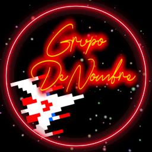

# Our Team - GrupoDeNombre

## Team Members
* **Code/QA**: [Jan Corredor Mayol](https://github.com/JanCorredor) 
    -  Enemies
    -  Particles
    -  Score System

* **Design/Art/Management**: [Arnau Gonzalez Olivé](https://github.com/Arnauwu) 
     - Timer
     - Player
     - Boss

## Description of the game
Galaga 88' is a Top-down space combat Shoot 'em up game released in 1987 for the Namco System 1.
You take the role of the Blast Fighter, a starship aimed to destroy the hostile Galaga forces and their home planet.

## Wiki
[https://github.com/JanCorredor/ProyectoGalaga-88/wiki](https://github.com/JanCorredor/ProyectoGalaga-88/wiki)

### Trailer video
[https://www.youtube.com/watch?v=vjk5JAGVWO4](https://www.youtube.com/watch?v=vjk5JAGVWO4)

## Release
[https://github.com/JanCorredor/ProyectoGalaga-88/releases/tag/Final](https://github.com/JanCorredor/ProyectoGalaga-88/releases/tag/Final)

## Controls
### In the main menu:
- Enter to start
- Up Arrow for Hardcore Difficulty (Slightly Harder)

### In gameplay:
- Arrows to move left or right
- Space to Shoot

### In endscreen
- Enter to return to menu

## Things Implemented
- Main Menu
- UI and Sounds
- Basic player mechanics
- 4 Enemies + 1 Boss
- 2 stages
- Score System
- Win/lose conditions

## Extra Features
- Score Leaderboard
- Hardmode
- DevKeys
    - R to reset all scores(Main Menu Only)
    - I to toggle Godmode
    - H to toggle Hitboxes Visibility
    - 1 to go to Stage 1
    - 2 to go to Stage 2
    - 3 to go to Bossfight 
    - 4 to go to the ending screen
    - 0 to go tothe Main Menu 
      
